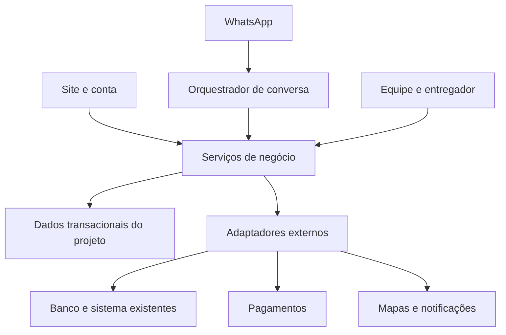

# Arquitetura proposta

## Superfícies

A loja pública permite descobrir produtos e serviços. A conta mantém identidade, pedidos e agenda. A equipe opera catálogo, pedidos, caixa, serviços e atendimento. O entregador recebe tarefas e publica posições autorizadas. Site e WhatsApp usam os mesmos serviços de negócio, preservando um pedido central.

## Módulos

Catálogo normaliza produtos e variantes de uma fonte autorizada. Carrinho guarda intenção. Checkout revalida as condições e cria o pedido. Estoque coordena reserva/liberação com a loja. Pagamentos registra tentativas e concilia eventos. Entrega organiza rotas e posições. Agenda controla recursos de banho e tosa. Conversas mantém contexto, botões e atendimento humano. Identidade aplica acesso. Conteúdo mantém apresentação e políticas.

Proposta técnica: aplicação web responsiva com backend modular e tarefas assíncronas, sem exigir microsserviços. Banco transacional com suporte a transações e restrições de unicidade; fila persistente ou mecanismo equivalente para integrações. Tecnologia e versões serão escolhidas após conhecer o sistema existente. As referências React do Word favorecem uma interface compatível, mas não obrigam hospedar tudo na mesma plataforma.

## Fronteira de leitura e escrita

O requisito do chat é ler o banco existente. Isso não autoriza conceder escrita SQL ao modelo. Um adaptador consulta views ou endpoints permitidos; a camada de aplicação transforma respostas em produtos com IDs, preços e atualizações. O bot solicita ações por ferramentas tipadas. Pedidos, pagamentos, reservas e agenda são criados por comandos autenticados que aplicam as mesmas regras do checkout.

Se o sistema existente tiver API de criação de venda/reserva, o adaptador poderá usá-la depois de validar contrato. Se for somente leitura, o novo projeto registra a intenção/pedido em sua base e encaminha a conferência para a operação. Não existe promessa de estoque em tempo real compartilhado sem uma estratégia de reserva ou confirmação com o balcão.

## Consistência

Pedido e evento de saída são gravados de forma atômica na base própria. Um processador entrega a integração e marca sucesso. Falha gera retentativa com a mesma chave; após limite, revisão humana. Esse padrão não torna duas bases uma única transação: compensações de reserva, cobrança e cancelamento devem ser explícitas.

## Ambientes

Desenvolvimento com dados fictícios; homologação com integrações de teste e contatos de teste; produção com credenciais próprias. Nenhum envio, cobrança ou escrita real faz parte desta documentação. Migrações da base nova versionadas; nenhuma alteração do esquema legado presumida.
