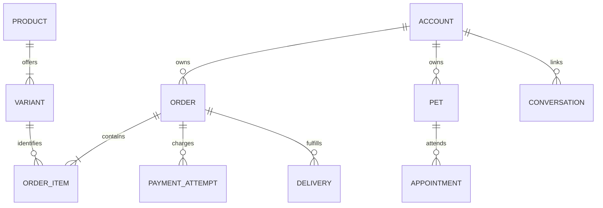

# Relacionamentos e integridade

Cardinalidade DELIVERY permite histórico de tentativas/reenvio; restringir no modelo físico uma entrega ativa por pedido enquanto entrega parcial não estiver no escopo. Relação de conversa com conta é opcional até autenticação. Recursos e agendamentos têm relação muitos para muitos, com ocupação em intervalos e capacidade.

## Restrições obrigatórias de projeto

Código externo único por sistema; número público de pedido único; evento de pagamento único por provedor/ID; mensagem única por canal/ID externo; uma chave idempotente identifica conteúdo e resultado, não pode ser reutilizada com payload diferente; reserva de horário não pode exceder capacidade; rotas não têm a mesma entrega ativa duas vezes.

Valores de pedido são snapshots: excluir ou renomear produto no catálogo não muda venda passada. Endereço da conta não é endereço histórico do pedido. Pet arquivado não apaga agendamento. Desativar equipe revoga acesso, preservando autoria anterior. Soft delete/arquivamento deve ter regra explícita por entidade; não usar cascata que apague financeiro ou auditoria.

## Transações

Criar pedido, itens, intenção de reserva e evento outbox juntos na base própria. Confirmar slot e recursos de agenda atomicamente. Reserva no legado e criação local exigem saga/compensação: em falha, liberar reserva externa quando comprovadamente criada; se resultado desconhecido, reconciliar pelo identificador antes de repetir. Não compensar “no escuro” uma transação que pode ter sido cobrada.
