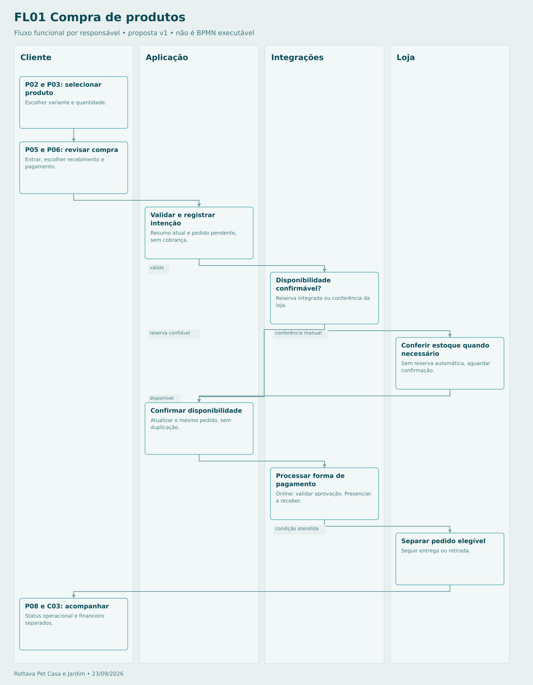

# Compra de produtos

Se preço/frete mudar, voltar à revisão. Se não houver estoque, ajustar itens antes de cobrar. Ordem exata entre intenção local e reserva externa é coordenada por compensação; não existe transação única presumida entre bases.

## Sequência

1. **Cliente — P02 e P03: selecionar produto.** Escolher variante e quantidade.
2. **Cliente — P05 e P06: revisar compra.** Entrar, escolher recebimento e pagamento.
3. **Aplicação — Validar e registrar intenção.** Resumo atual e pedido pendente, sem cobrança.
4. **Integrações — Disponibilidade confirmável?.** Reserva integrada ou conferência da loja.
5. **Loja — Conferir estoque quando necessário.** Sem reserva automática, aguardar confirmação.
6. **Aplicação — Confirmar disponibilidade.** Atualizar o mesmo pedido, sem duplicação.
7. **Integrações — Processar forma de pagamento.** Online: validar aprovação. Presencial: a receber.
8. **Loja — Separar pedido elegível.** Seguir entrega ou retirada.
9. **Cliente — P08 e C03: acompanhar.** Status operacional e financeiro separados.

[Fonte Mermaid editável](FL01-COMPRA.mmd) · [Imagem PNG](FL01-COMPRA.png)
