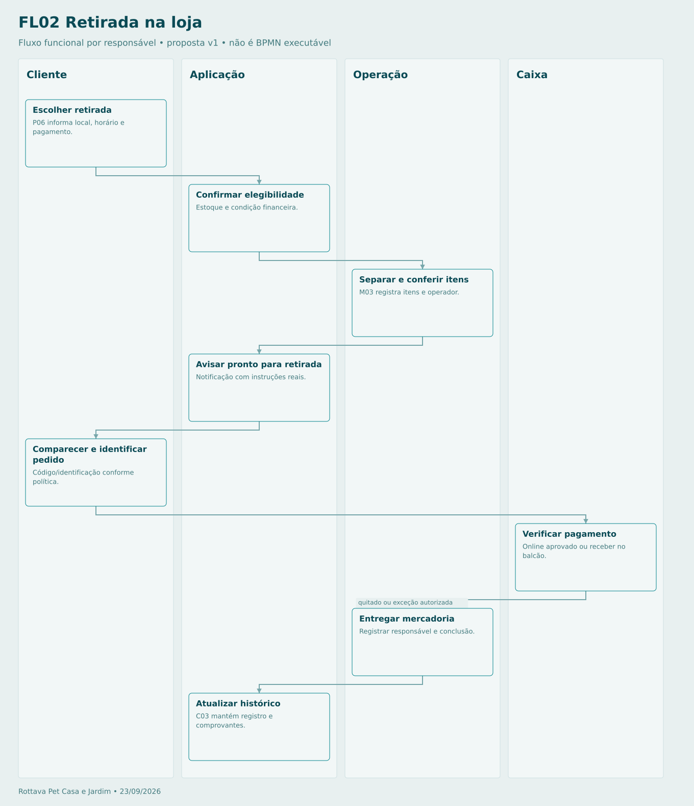

# Retirada na loja

Sem pagamento devido confirmado, não liberar por padrão. Retirada por terceiro e prazo de guarda dependem da política da loja. Ausência não gera cancelamento automático sem regra aprovada.

## Sequência

1. **Cliente — Escolher retirada.** P06 informa local, horário e pagamento.
2. **Aplicação — Confirmar elegibilidade.** Estoque e condição financeira.
3. **Operação — Separar e conferir itens.** M03 registra itens e operador.
4. **Aplicação — Avisar pronto para retirada.** Notificação com instruções reais.
5. **Cliente — Comparecer e identificar pedido.** Código/identificação conforme política.
6. **Caixa — Verificar pagamento.** Online aprovado ou receber no balcão.
7. **Operação — Entregar mercadoria.** Registrar responsável e conclusão.
8. **Aplicação — Atualizar histórico.** C03 mantém registro e comprovantes.

[Fonte Mermaid editável](FL02-RETIRADA.mmd) · [Imagem PNG](FL02-RETIRADA.png)
