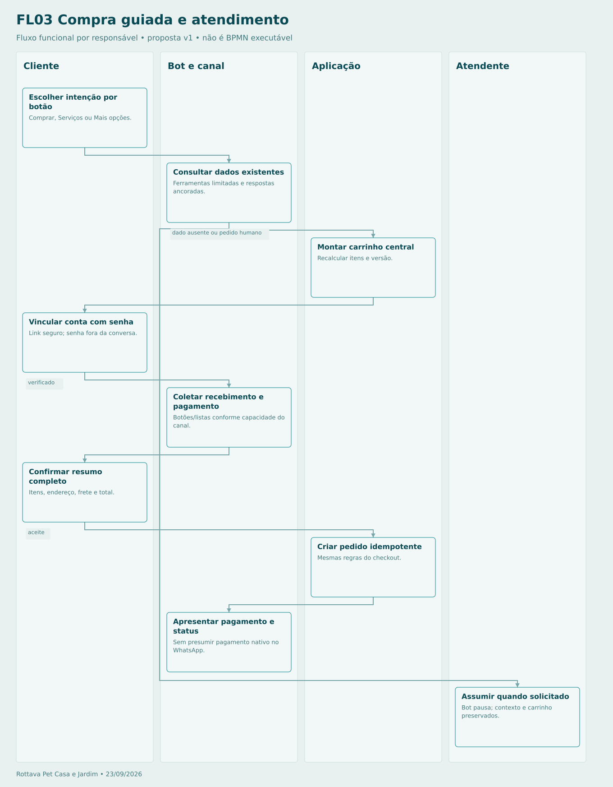

# Compra guiada e atendimento

Clique antigo é rejeitado/revisado; mensagens repetidas são deduplicadas. Atendimento humano pode ser acionado em qualquer etapa. Sem identidade verificada, não consultar pedidos pessoais.

## Sequência

1. **Cliente — Escolher intenção por botão.** Comprar, Serviços ou Mais opções.
2. **Bot e canal — Consultar dados existentes.** Ferramentas limitadas e respostas ancoradas.
3. **Aplicação — Montar carrinho central.** Recalcular itens e versão.
4. **Cliente — Vincular conta com senha.** Link seguro; senha fora da conversa.
5. **Bot e canal — Coletar recebimento e pagamento.** Botões/listas conforme capacidade do canal.
6. **Cliente — Confirmar resumo completo.** Itens, endereço, frete e total.
7. **Aplicação — Criar pedido idempotente.** Mesmas regras do checkout.
8. **Bot e canal — Apresentar pagamento e status.** Sem presumir pagamento nativo no WhatsApp.
9. **Atendente — Assumir quando solicitado.** Bot pausa; contexto e carrinho preservados.

[Fonte Mermaid editável](FL03-CONVERSA.mmd) · [Imagem PNG](FL03-CONVERSA.png)
