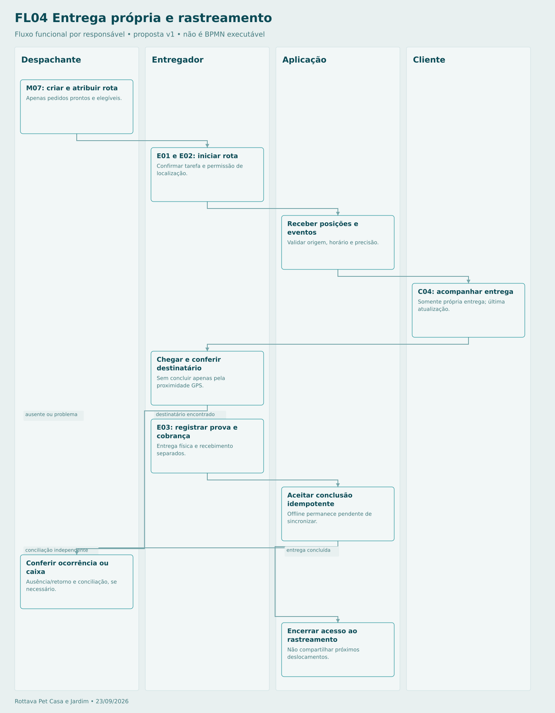

# Entrega própria e rastreamento

Sem localização recente, mostrar estado textual. Cliente não vê outras paradas. Operação com tela bloqueada depende de validação técnica do dispositivo/app. Cobrança presencial não é quitada apenas por entregar.

## Sequência

1. **Despachante — M07: criar e atribuir rota.** Apenas pedidos prontos e elegíveis.
2. **Entregador — E01 e E02: iniciar rota.** Confirmar tarefa e permissão de localização.
3. **Aplicação — Receber posições e eventos.** Validar origem, horário e precisão.
4. **Cliente — C04: acompanhar entrega.** Somente própria entrega; última atualização.
5. **Entregador — Chegar e conferir destinatário.** Sem concluir apenas pela proximidade GPS.
6. **Entregador — E03: registrar prova e cobrança.** Entrega física e recebimento separados.
7. **Aplicação — Aceitar conclusão idempotente.** Offline permanece pendente de sincronizar.
8. **Despachante — Conferir ocorrência ou caixa.** Ausência/retorno e conciliação, se necessário.
9. **Aplicação — Encerrar acesso ao rastreamento.** Não compartilhar próximos deslocamentos.

[Fonte Mermaid editável](FL04-ENTREGA.mmd) · [Imagem PNG](FL04-ENTREGA.png)
