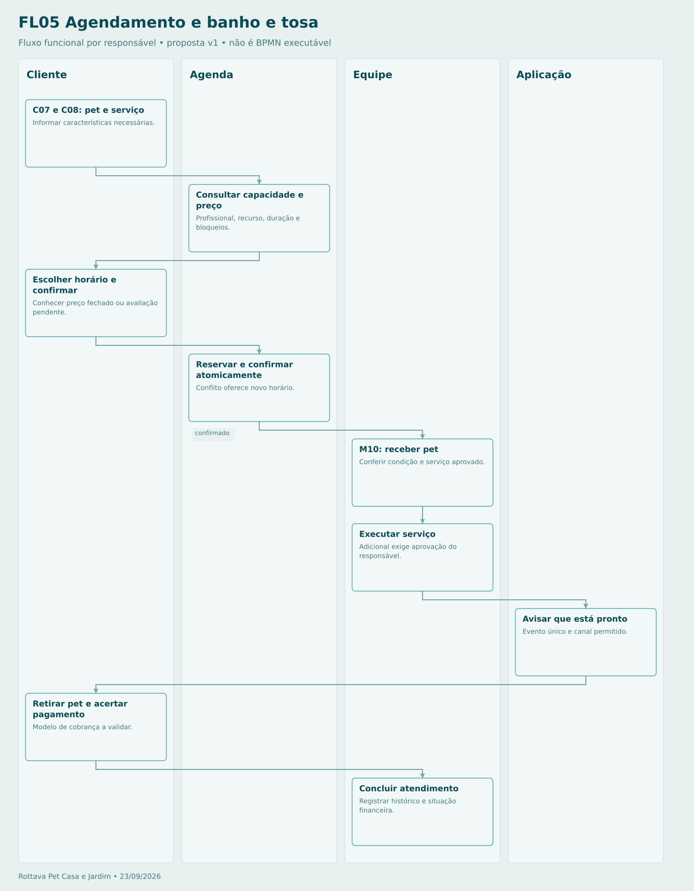

# Agendamento e banho e tosa

Se depender de avaliação, manter solicitação pendente até confirmação da equipe. Remarcação reserva novo horário antes de liberar anterior. Não há taxas de falta/cancelamento definidas.

## Sequência

1. **Cliente — C07 e C08: pet e serviço.** Informar características necessárias.
2. **Agenda — Consultar capacidade e preço.** Profissional, recurso, duração e bloqueios.
3. **Cliente — Escolher horário e confirmar.** Conhecer preço fechado ou avaliação pendente.
4. **Agenda — Reservar e confirmar atomicamente.** Conflito oferece novo horário.
5. **Equipe — M10: receber pet.** Conferir condição e serviço aprovado.
6. **Equipe — Executar serviço.** Adicional exige aprovação do responsável.
7. **Aplicação — Avisar que está pronto.** Evento único e canal permitido.
8. **Cliente — Retirar pet e acertar pagamento.** Modelo de cobrança a validar.
9. **Equipe — Concluir atendimento.** Registrar histórico e situação financeira.

[Fonte Mermaid editável](FL05-BANHO-E-TOSA.mmd) · [Imagem PNG](FL05-BANHO-E-TOSA.png)
