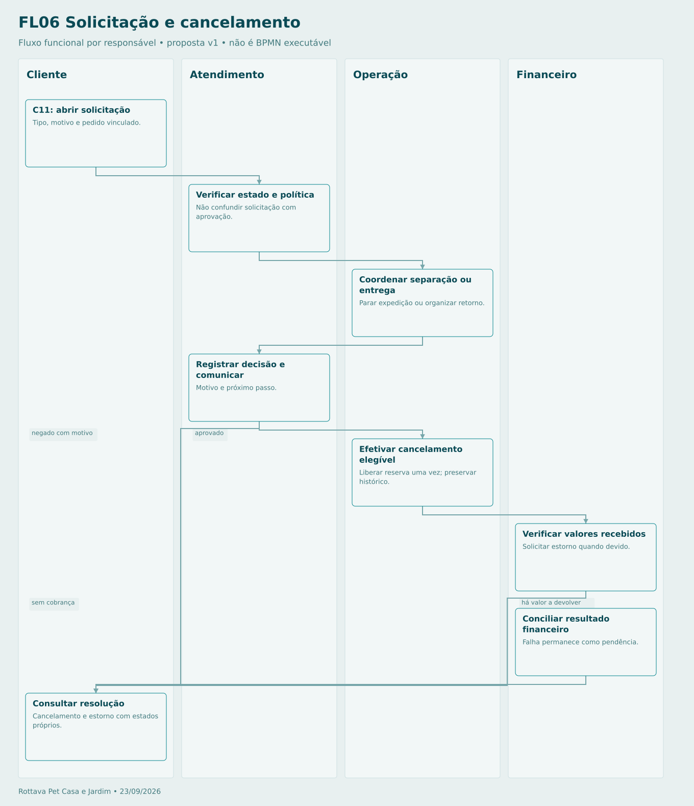

# Solicitação e cancelamento

Prazos e elegibilidade são definidos pela política aprovada e pela situação real. Estorno é assíncrono. Cancelamento não apaga pedido nem quita divergência.

## Sequência

1. **Cliente — C11: abrir solicitação.** Tipo, motivo e pedido vinculado.
2. **Atendimento — Verificar estado e política.** Não confundir solicitação com aprovação.
3. **Operação — Coordenar separação ou entrega.** Parar expedição ou organizar retorno.
4. **Atendimento — Registrar decisão e comunicar.** Motivo e próximo passo.
5. **Operação — Efetivar cancelamento elegível.** Liberar reserva uma vez; preservar histórico.
6. **Financeiro — Verificar valores recebidos.** Solicitar estorno quando devido.
7. **Financeiro — Conciliar resultado financeiro.** Falha permanece como pendência.
8. **Cliente — Consultar resolução.** Cancelamento e estorno com estados próprios.

[Fonte Mermaid editável](FL06-CANCELAMENTO.mmd) · [Imagem PNG](FL06-CANCELAMENTO.png)
