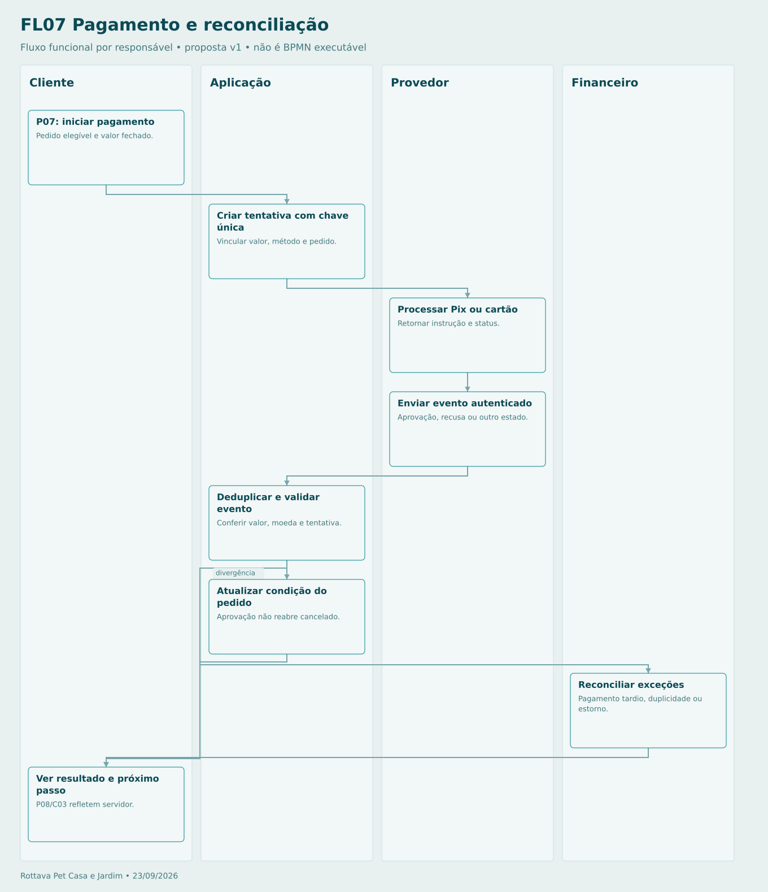

# Pagamento e reconciliação

Retorno do browser não é confirmação. Timeout consulta tentativa existente. Presencial usa recebimento e conciliação próprios, sem webhook de aprovação fictício.

## Sequência

1. **Cliente — P07: iniciar pagamento.** Pedido elegível e valor fechado.
2. **Aplicação — Criar tentativa com chave única.** Vincular valor, método e pedido.
3. **Provedor — Processar Pix ou cartão.** Retornar instrução e status.
4. **Provedor — Enviar evento autenticado.** Aprovação, recusa ou outro estado.
5. **Aplicação — Deduplicar e validar evento.** Conferir valor, moeda e tentativa.
6. **Aplicação — Atualizar condição do pedido.** Aprovação não reabre cancelado.
7. **Financeiro — Reconciliar exceções.** Pagamento tardio, duplicidade ou estorno.
8. **Cliente — Ver resultado e próximo passo.** P08/C03 refletem servidor.

[Fonte Mermaid editável](FL07-PAGAMENTOS.mmd) · [Imagem PNG](FL07-PAGAMENTOS.png)
