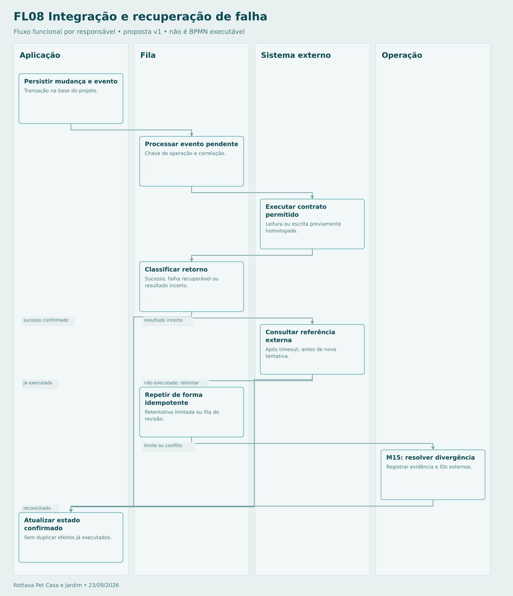

# Integração e recuperação de falha

Integração de escrita é condicional à descoberta. Fila não cria autorização. Reprocessar usa a mesma chave; se só houver leitura, pedidos aguardam conferência no fluxo operacional.

## Sequência

1. **Aplicação — Persistir mudança e evento.** Transação na base do projeto.
2. **Fila — Processar evento pendente.** Chave de operação e correlação.
3. **Sistema externo — Executar contrato permitido.** Leitura ou escrita previamente homologada.
4. **Fila — Classificar retorno.** Sucesso, falha recuperável ou resultado incerto.
5. **Sistema externo — Consultar referência externa.** Após timeout, antes de nova tentativa.
6. **Fila — Repetir de forma idempotente.** Retentativa limitada ou fila de revisão.
7. **Operação — M15: resolver divergência.** Registrar evidência e IDs externos.
8. **Aplicação — Atualizar estado confirmado.** Sem duplicar efeitos já executados.

[Fonte Mermaid editável](FL08-INTEGRACAO.mmd) · [Imagem PNG](FL08-INTEGRACAO.png)
