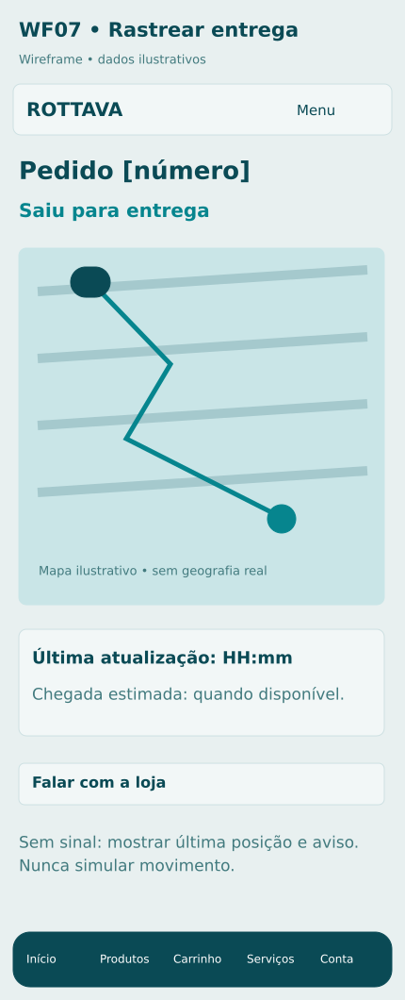

# C04 Acompanhar entrega

**Rota proposta:** `/minha-conta/pedidos/:id/entrega`  
**Acesso:** Cliente dono  
**Situação:** especificação proposta v1 — não implementada.

## Objetivo
Exibir localização da entrega ativa e contexto quando não há posição recente.

## Composição e hierarquia
Mapa com destino e última posição permitida; previsão estimada; horário da atualização; status textual; instruções ao destinatário; contato com loja.

## Ações e navegação
Recentrar mapa; abrir detalhes C03; informar dificuldade pelo atendimento; atualizar conexão.

## Regras e validações
Só pedido em entrega ativa mostra posição; cliente não vê outros destinos nem histórico completo do motorista; atraso de posição é explícito; rastreamento encerra na conclusão/cancelamento; ETA é estimativa.

## Estados e exceções
Antes da saída: mostrar preparação; localização negada/offline: última atualização, sem fingir movimento; mapa falhou: status textual; tentativa frustrada: orientação.

## Dados e integrações
GET /deliveries/:id/tracking e canal autenticado de eventos; mapa e posição do entregador. Os caminhos de API são contratos propostos; não representam endpoints existentes já verificados.

## Responsividade e acessibilidade
No celular, usar coluna única, foco visível e botões com rótulos; manter o contexto ao voltar. Campos têm rótulos e erros associados; cor não é o único indicador; operações em andamento impedem reenvio acidental, sem substituir idempotência no servidor.

## Critérios de aceite
- Cliente não assina canal de outra entrega.
- tela informa posição desatualizada.
- após entrega não acompanha deslocamentos posteriores.

## Documentação relacionada
[Mapa de telas](../DOCUMENTACAO/00-ARQUITETURA-E-ESCOPO/03-MAPA-DE-TELAS.md) · [Regras de negócio](../DOCUMENTACAO/04-BANCO-DE-DADOS-E-LOGICA/04-REGRAS-DE-NEGOCIO.md) · [Estados](../DOCUMENTACAO/04-BANCO-DE-DADOS-E-LOGICA/03-ESTADOS-E-CICLOS.md) · [Pendências](../DOCUMENTACAO/06-PLANEJAMENTO-E-VALIDACAO/01-DECISOES-PENDENTES.md)

## Estudo visual WF07-RASTREAMENTO

Mapa apenas durante entrega ativa, com timestamp e estado textual. Não expõe outras paradas.

[Versão PNG](../WIREFRAMES/WF07-RASTREAMENTO.png)
