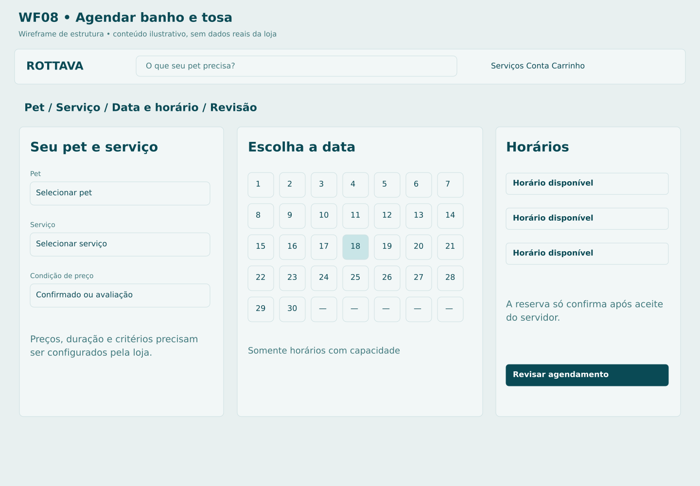

# C08 Agendar banho e tosa

**Rota proposta:** `/agendar`  
**Acesso:** Cliente  
**Situação:** especificação proposta v1 — não implementada.

## Objetivo
Escolher pet, serviço e horário e confirmar condições do atendimento.

## Composição e hierarquia
Etapas Pet, Serviço, Data/horário e Revisão; duração e preço quando determináveis; horários realmente disponíveis; observações; política aplicável; confirmar.

## Ações e navegação
Selecionar pet existente ou cadastrar C07; escolher serviço/adicionais; consultar horários; reservar temporariamente; confirmar; abrir C10.

## Regras e validações
Reserva de horário é atômica por recursos e duração; equipe, intervalos, bloqueios e feriados devem ser considerados; pagamento online de serviços e sinal são pendências; proposta inicial mantém agendamento separado de compra de produtos.

## Estados e exceções
Horário ocupado durante revisão: oferecer alternativas; preço depende de avaliação: solicitação de confirmação humana; agenda offline: não confirmar; sessão expirada preserva intenção sem segurar vaga indefinidamente.

## Dados e integrações
GET /availability; POST /appointment-holds; POST /appointments; pet, serviços e recursos. Os caminhos de API são contratos propostos; não representam endpoints existentes já verificados.

## Responsividade e acessibilidade
No celular, usar coluna única, foco visível e botões com rótulos; manter o contexto ao voltar. Campos têm rótulos e erros associados; cor não é o único indicador; operações em andamento impedem reenvio acidental, sem substituir idempotência no servidor.

## Critérios de aceite
- Dois clientes não confirmam a mesma capacidade.
- valor indeterminado é identificado.
- horário exibido usa America/Sao_Paulo.

## Documentação relacionada
[Mapa de telas](../DOCUMENTACAO/00-ARQUITETURA-E-ESCOPO/03-MAPA-DE-TELAS.md) · [Regras de negócio](../DOCUMENTACAO/04-BANCO-DE-DADOS-E-LOGICA/04-REGRAS-DE-NEGOCIO.md) · [Estados](../DOCUMENTACAO/04-BANCO-DE-DADOS-E-LOGICA/03-ESTADOS-E-CICLOS.md) · [Pendências](../DOCUMENTACAO/06-PLANEJAMENTO-E-VALIDACAO/01-DECISOES-PENDENTES.md)

## Estudo visual WF08-AGENDAMENTO

Calendário ilustrativo sem mês real. Recurso e duração definem vagas; disputa de slot é resolvida no backend.

[Versão PNG](../WIREFRAMES/WF08-AGENDAMENTO.png)
