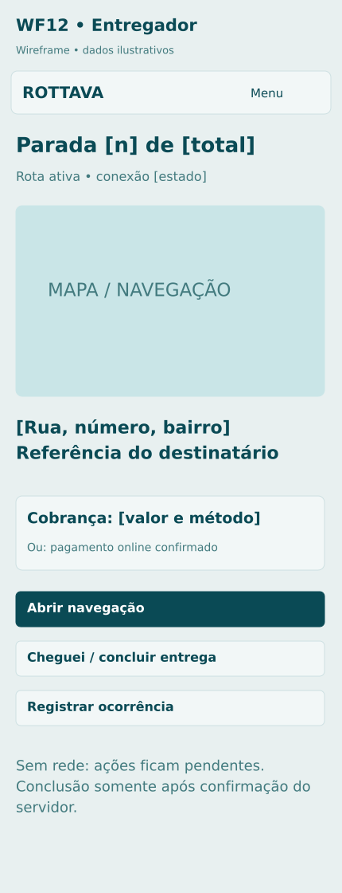

# E02 Rota e parada ativa

**Rota proposta:** `/entregador/rotas/:id`  
**Acesso:** Entregador atribuído  
**Situação:** especificação proposta v1 — não implementada.

## Objetivo
Navegar, atualizar posição e registrar ocorrências de cada parada.

## Composição e hierarquia
Mapa/lista de paradas; destino atual; contato necessário; referência; volumes; valor a cobrar; Navegar; Cheguei; Ocorrência; Concluir entrega.

## Ações e navegação
Abrir navegador de mapas; enviar posições com horário/precisão; marcar chegada; relatar cliente ausente; abrir E03; seguir próxima parada após aceite do servidor.

## Regras e validações
Fila offline usa IDs únicos; não confirmar entrega só por proximidade GPS; evitar edição enquanto dirige; mudança de motorista revoga acesso; rastreamento contínuo em segundo plano precisa validação técnica específica.

## Estados e exceções
Sem rede: fila local visível; posição antiga: aviso; rota alterada: atualizar; endereço incorreto: contato sem alteração silenciosa.

## Dados e integrações
POST /driver/location-batches; /deliveries/:id/events; provedor de mapa/navegação. Os caminhos de API são contratos propostos; não representam endpoints existentes já verificados.

## Responsividade e acessibilidade
No celular, priorizar tarefa atual, botões grandes e lista em vez de tabela; mapa é complementar. Campos têm rótulos e erros associados; cor não é o único indicador; operações em andamento impedem reenvio acidental, sem substituir idempotência no servidor.

## Critérios de aceite
- Reconexão não duplica eventos.
- posição tem timestamp.
- fim da rota encerra compartilhamento.

## Documentação relacionada
[Mapa de telas](../DOCUMENTACAO/00-ARQUITETURA-E-ESCOPO/03-MAPA-DE-TELAS.md) · [Regras de negócio](../DOCUMENTACAO/04-BANCO-DE-DADOS-E-LOGICA/04-REGRAS-DE-NEGOCIO.md) · [Estados](../DOCUMENTACAO/04-BANCO-DE-DADOS-E-LOGICA/03-ESTADOS-E-CICLOS.md) · [Pendências](../DOCUMENTACAO/06-PLANEJAMENTO-E-VALIDACAO/01-DECISOES-PENDENTES.md)

## Estudo visual WF12-ENTREGADOR

Interface de campo com cobrança explícita, ocorrência e estado de conectividade.

[Versão PNG](../WIREFRAMES/WF12-ENTREGADOR.png)
