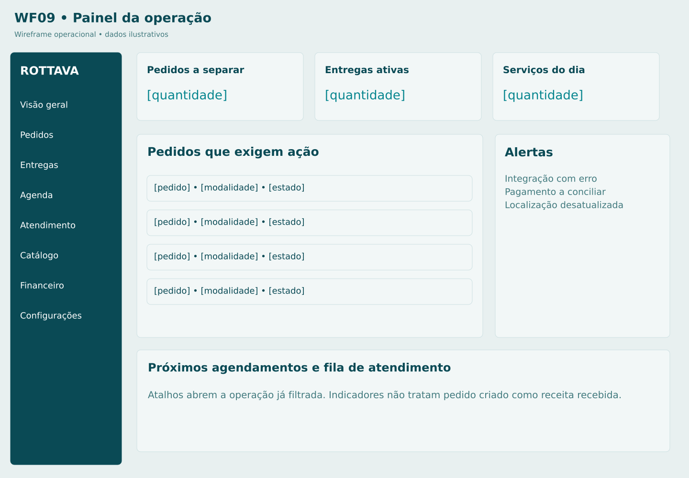

# M01 Visão geral operacional

**Rota proposta:** `/admin`  
**Acesso:** Equipe autorizada  
**Situação:** especificação proposta v1 — não implementada.

## Objetivo
Mostrar o que exige ação imediata na loja.

## Composição e hierarquia
Fila de pedidos por etapa; pagamentos a receber; entregas atrasadas; próximos serviços; atendimentos humanos; alertas de integração; filtros por período.

## Ações e navegação
Abrir M02, M07, M09, M12, M14 ou M15 a partir do indicador; atualizar dados.

## Regras e validações
Indicadores operacionais têm definição explícita; recebido financeiro é diferente de pedido criado; cada bloco respeita papel; sem integração mostrar alerta, não zero enganoso.

## Estados e exceções
Sem tarefas; dados parciais com horário da última atualização; fonte indisponível.

## Dados e integrações
GET /admin/summary agregando pedidos, pagamentos, serviços e saúde de integrações. Os caminhos de API são contratos propostos; não representam endpoints existentes já verificados.

## Responsividade e acessibilidade
No celular, priorizar tarefa atual, botões grandes e lista em vez de tabela; mapa é complementar. Campos têm rótulos e erros associados; cor não é o único indicador; operações em andamento impedem reenvio acidental, sem substituir idempotência no servidor.

## Critérios de aceite
- Clique abre fila com mesmo filtro.
- valores não somam pedidos cancelados como receita recebida.

## Documentação relacionada
[Mapa de telas](../DOCUMENTACAO/00-ARQUITETURA-E-ESCOPO/03-MAPA-DE-TELAS.md) · [Regras de negócio](../DOCUMENTACAO/04-BANCO-DE-DADOS-E-LOGICA/04-REGRAS-DE-NEGOCIO.md) · [Estados](../DOCUMENTACAO/04-BANCO-DE-DADOS-E-LOGICA/03-ESTADOS-E-CICLOS.md) · [Pendências](../DOCUMENTACAO/06-PLANEJAMENTO-E-VALIDACAO/01-DECISOES-PENDENTES.md)

## Estudo visual WF09-PAINEL

Filas acionáveis e métricas operacionais. Permissões controlam cada bloco.

[Versão PNG](../WIREFRAMES/WF09-PAINEL.png)
