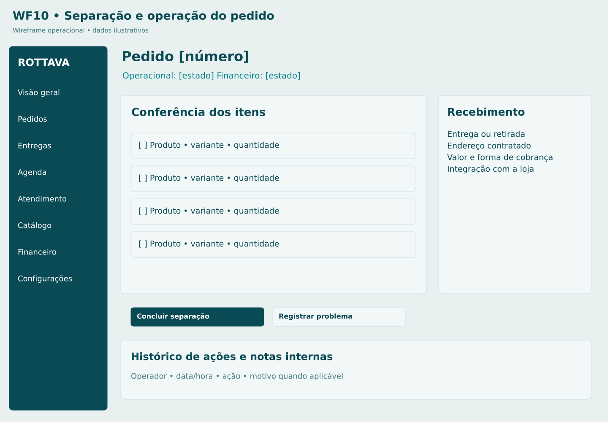

# M03 Operação de um pedido

**Rota proposta:** `/admin/pedidos/:id`  
**Acesso:** Operador, gestor; financeiro em ações próprias  
**Situação:** especificação proposta v1 — não implementada.

## Objetivo
Validar, separar e encaminhar o pedido com trilha de auditoria.

## Composição e hierarquia
Itens e conferência; status separados; integração com sistema existente; pagamento; endereço; notas internas; eventos; ações contextuais e solicitação do cliente.

## Ações e navegação
Confirmar disponibilidade; iniciar/concluir separação; marcar pronto para retirada; encaminhar despacho; registrar retirada com conferência; propor substituição; analisar cancelamento; abrir financeiro M14.

## Regras e validações
Sem substituição automática; preço/item alterado exige cliente aprovar e conciliar diferença; item reservado não deve ser consumido duas vezes; cancelamento libera reserva uma vez; retirada por terceiro segue regra a definir.

## Estados e exceções
Falta física de item: bloquear e contactar; edição concorrente: recarregar; falha no legado: pendente de reconciliação; retirada não confirmada.

## Dados e integrações
GET /admin/orders/:id; comandos /confirm, /start-picking, /ready, /pickup, /cancel; adaptador legado. Os caminhos de API são contratos propostos; não representam endpoints existentes já verificados.

## Responsividade e acessibilidade
No celular, priorizar tarefa atual, botões grandes e lista em vez de tabela; mapa é complementar. Campos têm rótulos e erros associados; cor não é o único indicador; operações em andamento impedem reenvio acidental, sem substituir idempotência no servidor.

## Critérios de aceite
- Transições inválidas são rejeitadas.
- toda ação registra autor e motivo quando aplicável.
- pedido entregue não retorna a separação por evento atrasado.

## Documentação relacionada
[Mapa de telas](../DOCUMENTACAO/00-ARQUITETURA-E-ESCOPO/03-MAPA-DE-TELAS.md) · [Regras de negócio](../DOCUMENTACAO/04-BANCO-DE-DADOS-E-LOGICA/04-REGRAS-DE-NEGOCIO.md) · [Estados](../DOCUMENTACAO/04-BANCO-DE-DADOS-E-LOGICA/03-ESTADOS-E-CICLOS.md) · [Pendências](../DOCUMENTACAO/06-PLANEJAMENTO-E-VALIDACAO/01-DECISOES-PENDENTES.md)

## Estudo visual WF10-OPERAR-PEDIDO

Status financeiro não se mistura com separação. Falta física abre revisão com cliente.

[Versão PNG](../WIREFRAMES/WF10-OPERAR-PEDIDO.png)
