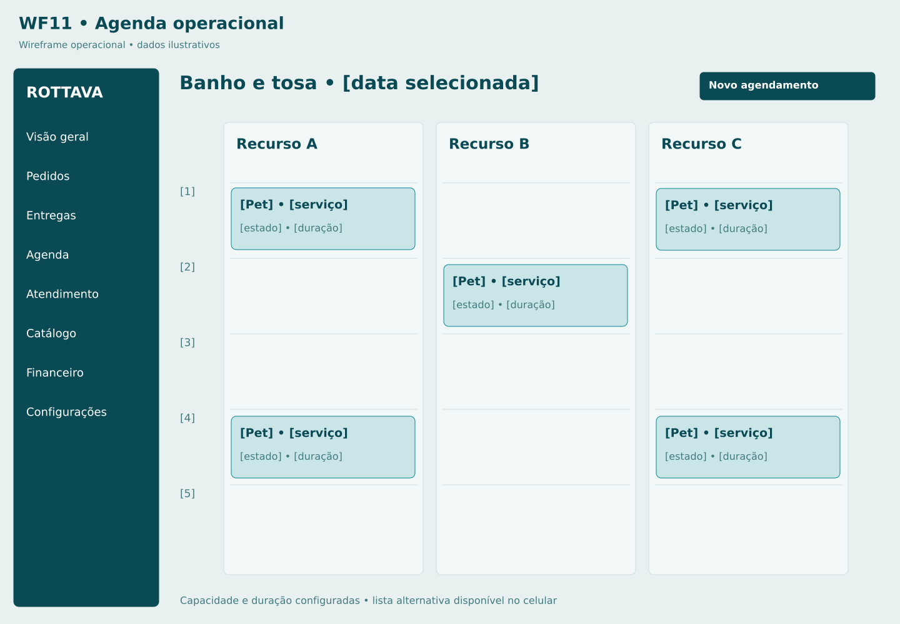

# M09 Agenda de banho e tosa

**Rota proposta:** `/admin/agenda`  
**Acesso:** Recepção, equipe de serviços, gestor  
**Situação:** especificação proposta v1 — não implementada.

## Objetivo
Gerenciar capacidade, reservas e atendimentos do dia.

## Composição e hierarquia
Calendário por profissional/recurso; lista alternativa; horários bloqueados; cartões por pet e status; filtros; solicitação sem horário confirmado.

## Ações e navegação
Criar agendamento assistido; bloquear intervalo; confirmar solicitação; remarcar; abrir M10; configurar serviços em M11.

## Regras e validações
Reserva manual e online passam pelo mesmo controle atômico; não sobrepor capacidade; confirmar preço de avaliação antes do atendimento; horário local da loja.

## Estados e exceções
Conflito de reserva; ausência de profissional; atraso; solicitação pendente; indisponibilidade do sistema.

## Dados e integrações
GET /admin/appointments; /availability; /resource-blocks; comandos de agenda. Os caminhos de API são contratos propostos; não representam endpoints existentes já verificados.

## Responsividade e acessibilidade
No celular, priorizar tarefa atual, botões grandes e lista em vez de tabela; mapa é complementar. Campos têm rótulos e erros associados; cor não é o único indicador; operações em andamento impedem reenvio acidental, sem substituir idempotência no servidor.

## Critérios de aceite
- Bloqueio impede nova reserva.
- reagendamento verifica capacidade.
- calendário e lista mostram os mesmos registros.

## Documentação relacionada
[Mapa de telas](../DOCUMENTACAO/00-ARQUITETURA-E-ESCOPO/03-MAPA-DE-TELAS.md) · [Regras de negócio](../DOCUMENTACAO/04-BANCO-DE-DADOS-E-LOGICA/04-REGRAS-DE-NEGOCIO.md) · [Estados](../DOCUMENTACAO/04-BANCO-DE-DADOS-E-LOGICA/03-ESTADOS-E-CICLOS.md) · [Pendências](../DOCUMENTACAO/06-PLANEJAMENTO-E-VALIDACAO/01-DECISOES-PENDENTES.md)

## Estudo visual WF11-AGENDA-ADMIN

Recursos ilustrativos; intervalos e capacidade reais serão definidos com a loja.

[Versão PNG](../WIREFRAMES/WF11-AGENDA-ADMIN.png)
