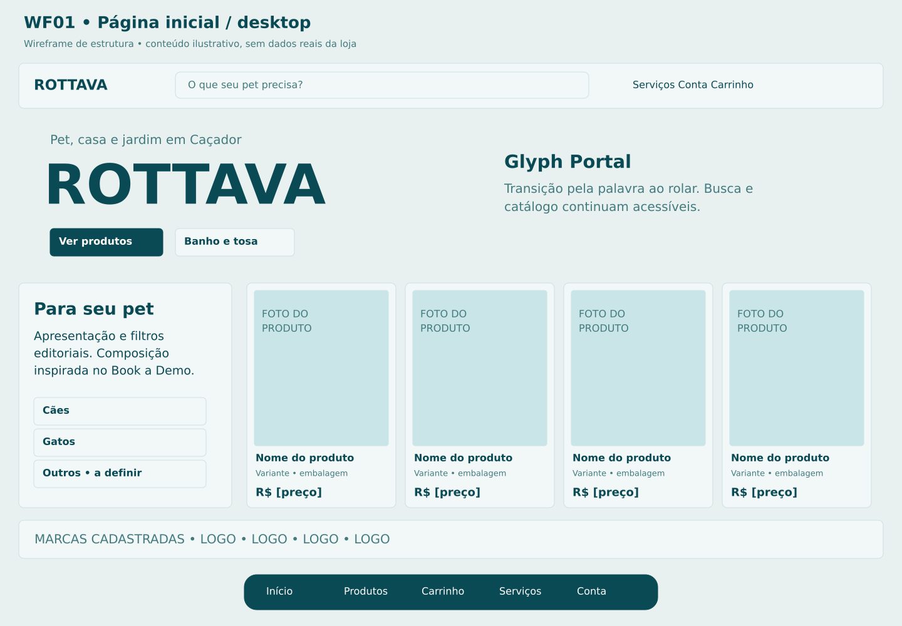
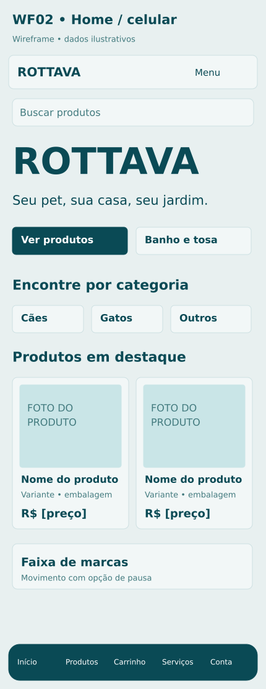

# P01 Página inicial

**Rota proposta:** `/`  
**Acesso:** Visitante e cliente  
**Situação:** especificação proposta v1 — não implementada.

## Objetivo
Apresentar a Rottava e levar rapidamente à compra ou ao banho e tosa.

## Composição e hierarquia
Cabeçalho com marca, busca e acesso à conta; hero com a palavra ROTTAVA, com Glyph Portal; acesso direto Ver produtos; vitrine em duas colunas inspirada no Book a Demo, com apresentação e categorias à esquerda e produtos à direita; blocos de categorias, destaques, banho e tosa, marcas e rodapé; dock persistente.

## Ações e navegação
Buscar leva a P02; selecionar produto abre P03; selecionar marca filtra P02; Agendar banho e tosa abre P04; Atendimento abre P09; Carrinho abre P05.

## Regras e validações
Preço e disponibilidade vêm do catálogo integrado; só mostrar marcas realmente cadastradas; ordenação dos destaques é editorial; animação não impede acessar busca ou catálogo; não apresentar promoções fictícias.

## Estados e exceções
Catálogo carregando: esqueletos; sem destaques: exibir categorias; integração indisponível: mensagem e contato; movimento reduzido: hero estático e acesso imediato aos produtos.

## Dados e integrações
GET /catalog/highlights, /catalog/categories, /catalog/brands e /store; conteúdo editorial publicado. Os caminhos de API são contratos propostos; não representam endpoints existentes já verificados.

## Responsividade e acessibilidade
No celular, usar coluna única, foco visível e botões com rótulos; manter o contexto ao voltar. Campos têm rótulos e erros associados; cor não é o único indicador; operações em andamento impedem reenvio acidental, sem substituir idempotência no servidor.

## Critérios de aceite
- Acesso ao catálogo funciona sem aguardar a animação.
- produto abre com a variante correta.
- mobile não tem rolagem horizontal.
- uma marca abre filtro correspondente.

## Documentação relacionada
[Mapa de telas](../DOCUMENTACAO/00-ARQUITETURA-E-ESCOPO/03-MAPA-DE-TELAS.md) · [Regras de negócio](../DOCUMENTACAO/04-BANCO-DE-DADOS-E-LOGICA/04-REGRAS-DE-NEGOCIO.md) · [Estados](../DOCUMENTACAO/04-BANCO-DE-DADOS-E-LOGICA/03-ESTADOS-E-CICLOS.md) · [Pendências](../DOCUMENTACAO/06-PLANEJAMENTO-E-VALIDACAO/01-DECISOES-PENDENTES.md)

## Estudo visual WF01-HOME-DESKTOP

Hero com acesso direto; vitrine em duas colunas e produtos à direita; slider com marcas reais. Categorias são exemplos a validar.

[Versão PNG](../WIREFRAMES/WF01-HOME-DESKTOP.png)

## Estudo visual WF02-HOME-MOBILE

Coluna única; atalho para produtos sem percorrer toda a animação; dock com rótulos. Busca é permanente no cabeçalho da loja.

[Versão PNG](../WIREFRAMES/WF02-HOME-MOBILE.png)
