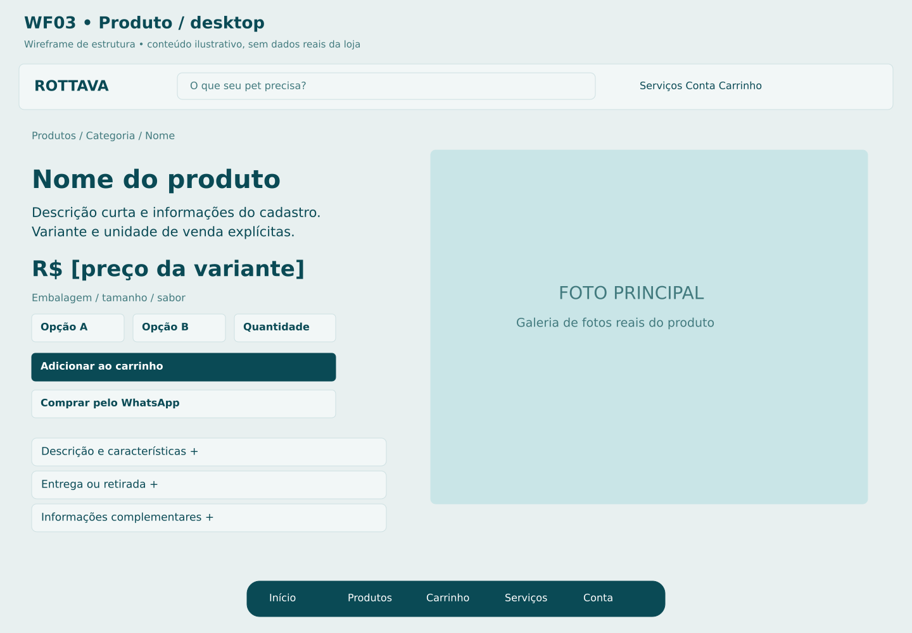
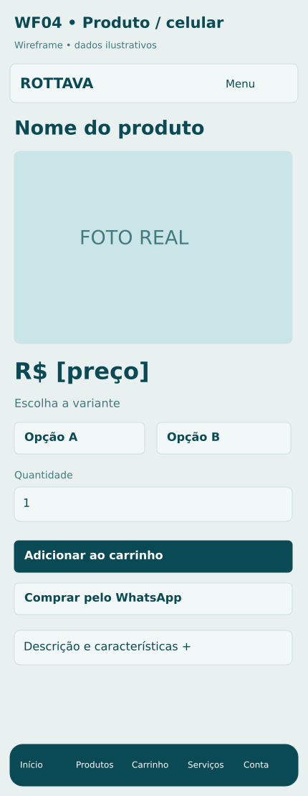

# P03 Detalhe do produto

**Rota proposta:** `/produto/:slug`  
**Acesso:** Visitante e cliente  
**Situação:** especificação proposta v1 — não implementada.

## Objetivo
Explicar o produto e permitir escolher exatamente o item que será comprado.

## Composição e hierarquia
Feature Showcase adaptado: informações à esquerda e galeria à direita no desktop; no celular, nome, imagem, preço e compra na sequência; variantes por peso, tamanho ou sabor; quantidade; Adicionar ao carrinho; Comprar pelo WhatsApp; consulta de entrega; descrição e características em acordeões.

## Ações e navegação
Trocar variante atualiza SKU, preço, foto e estoque; adicionar abre resumo do carrinho; WhatsApp leva identificador do produto/variante e intenção, sem afirmar que já há pedido; cotar entrega pede endereço suficiente; galeria permite ampliar.

## Regras e validações
Variante deve ser selecionada antes de adicionar; usar especificação do fabricante ou cadastro, sem inventar benefícios; frete é estimativa até validar carrinho e endereço; compra de item restrito depende da classificação do catálogo e política validada.

## Estados e exceções
Variante esgotada: indisponível; preço alterado: novo preço visível; descrição ausente: omitir seção; cotação indisponível: não prometer entrega; erro ao adicionar mantém seleção.

## Dados e integrações
GET /catalog/products/:id; POST /carts/:id/items; POST /shipping/quotes; transferência por token de contexto ao canal WhatsApp. Os caminhos de API são contratos propostos; não representam endpoints existentes já verificados.

## Responsividade e acessibilidade
No celular, usar coluna única, foco visível e botões com rótulos; manter o contexto ao voltar. Campos têm rótulos e erros associados; cor não é o único indicador; operações em andamento impedem reenvio acidental, sem substituir idempotência no servidor.

## Critérios de aceite
- Total corresponde à variante selecionada.
- clique duplo não duplica a operação.
- alterações no servidor são apresentadas antes da conclusão da compra.

## Documentação relacionada
[Mapa de telas](../DOCUMENTACAO/00-ARQUITETURA-E-ESCOPO/03-MAPA-DE-TELAS.md) · [Regras de negócio](../DOCUMENTACAO/04-BANCO-DE-DADOS-E-LOGICA/04-REGRAS-DE-NEGOCIO.md) · [Estados](../DOCUMENTACAO/04-BANCO-DE-DADOS-E-LOGICA/03-ESTADOS-E-CICLOS.md) · [Pendências](../DOCUMENTACAO/06-PLANEJAMENTO-E-VALIDACAO/01-DECISOES-PENDENTES.md)

## Estudo visual WF03-PRODUTO-DESKTOP

Feature Showcase adaptado: informação e compra à esquerda, fotografia à direita. Variante muda preço, foto e disponibilidade.

[Versão PNG](../WIREFRAMES/WF03-PRODUTO-DESKTOP.png)

## Estudo visual WF04-PRODUTO-MOBILE

Ordem mobile favorece imagem, variante, preço e compra. Botões não dependem de hover.

[Versão PNG](../WIREFRAMES/WF04-PRODUTO-MOBILE.png)
