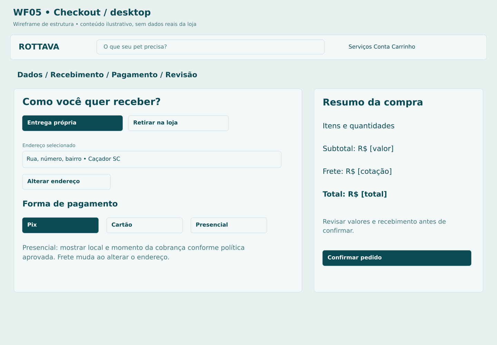

# P06 Finalização da compra

**Rota proposta:** `/checkout`  
**Acesso:** Cliente autenticado  
**Situação:** especificação proposta v1 — não implementada.

## Objetivo
Confirmar destinatário, modalidade, endereço, pagamento e total em um único resumo revisável.

## Composição e hierarquia
Etapas Dados, Recebimento, Pagamento e Revisão; endereço e referência para entrega ou dados da loja para retirada; previsão; opções Pix, cartão e presencial; resumo sempre acessível; confirmação explícita.

## Ações e navegação
Editar endereço abre C06 e retorna; trocar modalidade invalida frete anterior; escolher pagamento; confirmar chama criação idempotente; Pix/cartão abre P07; presencial abre P08 com pagamento pendente.

## Regras e validações
Revalidar preço, disponibilidade, área atendida e frete antes de criar; entrega própria apenas área configurada; presencial vale para entrega e retirada, com rótulos diferentes; pagamento presencial na entrega ou antecipado no balcão é decisão D04; nunca marcar presencial como pago automaticamente.

## Estados e exceções
Sessão expirada: login preservando carrinho; cotação vencida: recalcular e pedir revisão; estoque insuficiente: voltar aos itens; pedido criado com timeout: recuperar por chave, não criar outro.

## Dados e integrações
POST /shipping/quotes; POST /checkout/validate; POST /orders com cart_version, quote_id, payment_mode e idempotency_key. Os caminhos de API são contratos propostos; não representam endpoints existentes já verificados.

## Responsividade e acessibilidade
No celular, usar coluna única, foco visível e botões com rótulos; manter o contexto ao voltar. Campos têm rótulos e erros associados; cor não é o único indicador; operações em andamento impedem reenvio acidental, sem substituir idempotência no servidor.

## Critérios de aceite
- Dois cliques geram um pedido.
- valor alterado exige nova revisão.
- endereço fora de cobertura oferece retirada.
- pedido presencial nasce com saldo a receber.

## Documentação relacionada
[Mapa de telas](../DOCUMENTACAO/00-ARQUITETURA-E-ESCOPO/03-MAPA-DE-TELAS.md) · [Regras de negócio](../DOCUMENTACAO/04-BANCO-DE-DADOS-E-LOGICA/04-REGRAS-DE-NEGOCIO.md) · [Estados](../DOCUMENTACAO/04-BANCO-DE-DADOS-E-LOGICA/03-ESTADOS-E-CICLOS.md) · [Pendências](../DOCUMENTACAO/06-PLANEJAMENTO-E-VALIDACAO/01-DECISOES-PENDENTES.md)

## Estudo visual WF05-CHECKOUT

Frete validado pelo servidor; modalidade de recebimento e pagamento separadas; resumo confirmável. Sem valor de exemplo que pareça condição comercial real.

[Versão PNG](../WIREFRAMES/WF05-CHECKOUT.png)
