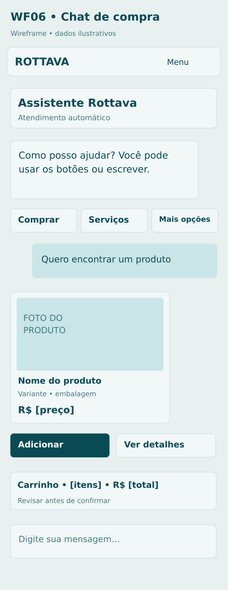

# P09 Chat de compra e atendimento

**Rota proposta:** `/atendimento`  
**Acesso:** Visitante; dados pessoais apenas após autenticação  
**Situação:** especificação proposta v1 — não implementada.

## Objetivo
Ajudar a escolher produtos, montar carrinho, agendar serviços e acompanhar pedidos com botões.

## Composição e hierarquia
Histórico de mensagens; identificação do bot ou atendente; botões Comprar produtos, Banho e tosa, Meus pedidos e Falar com pessoa; cards de produtos; resumo fixável do carrinho; campo livre; estado da conexão.

## Ações e navegação
Botões mudam etapa da conversa; adicionar/alterar item chama serviço central; confirmar pedido apresenta itens, entrega, frete e total; pagar abre fluxo seguro; chamar pessoa pausa automação na conversa.

## Regras e validações
Bot lê dados existentes via ferramentas limitadas; ações de escrita passam pelos serviços de pedidos; identidade do site não é automaticamente identidade do WhatsApp; pedido exige confirmação explícita; bot não solicita senha ou cartão na conversa.

## Estados e exceções
Leitura indisponível: não inventar preço/estoque; resposta atrasada: indicar consultando; humano ausente: fila com informação de horário; versão do carrinho mudou: revisar; mensagem repetida: ação deduplicada.

## Dados e integrações
POST /conversations; /messages; /chat/actions; gateway de ferramentas; catálogo, pedidos, agenda e transferência humana. Os caminhos de API são contratos propostos; não representam endpoints existentes já verificados.

## Responsividade e acessibilidade
No celular, usar coluna única, foco visível e botões com rótulos; manter o contexto ao voltar. Campos têm rótulos e erros associados; cor não é o único indicador; operações em andamento impedem reenvio acidental, sem substituir idempotência no servidor.

## Critérios de aceite
- A mesma intenção gera resultado consistente nos canais.
- botões antigos não executam ação obsoleta.
- dados de outro cliente nunca são retornados.

## Documentação relacionada
[Mapa de telas](../DOCUMENTACAO/00-ARQUITETURA-E-ESCOPO/03-MAPA-DE-TELAS.md) · [Regras de negócio](../DOCUMENTACAO/04-BANCO-DE-DADOS-E-LOGICA/04-REGRAS-DE-NEGOCIO.md) · [Estados](../DOCUMENTACAO/04-BANCO-DE-DADOS-E-LOGICA/03-ESTADOS-E-CICLOS.md) · [Pendências](../DOCUMENTACAO/06-PLANEJAMENTO-E-VALIDACAO/01-DECISOES-PENDENTES.md)

## Estudo visual WF06-CHAT

Botões conduzem etapas; carrinho central; preço vem da ferramenta. No WhatsApp, usar até três respostas rápidas e listas para menus maiores.

[Versão PNG](../WIREFRAMES/WF06-CHAT.png)
